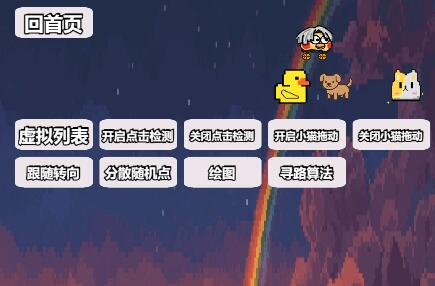

# 用于一些cocos功能测试和开发

## UI生成场景
- 普通消息通知

- 普通确认弹窗

## 功能测试场景
- 虚拟列表

- 触摸检测和节点坐标的相互转换

- 拖拽节点和节点的相交检测

- 节点跟随触摸位置转向

- 随机分散算法

- 手写绘制

- 简单a*寻路算法

## 游戏场景
- 简单迷宫 

## 设计模式
- 命令模式

### 设计模式笔记在[这里](summary/designMode/README.md)
