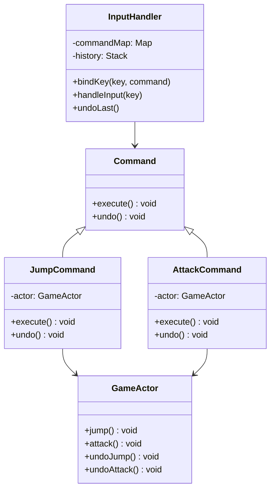

# 行为型模式

## 1.1 命令模式

### 1.1.1 描述和结构

 命令模式（Command Pattern）是一种**行为型设计模式**，它将一个请求封装为一个对象，从而允许你用不同的请求对客户进行参数化、对请求排队、记录日志以及支持撤销操作等。

```ts
// 命令接口
interface Command {
    execute(): void;
    undo(): void;
}

// 接收者：真正执行操作的对象
class GameActor {
    jump() { console.log("角色跳跃"); }
    attack() { console.log("角色攻击"); }
    undoJump() { console.log("撤销跳跃"); }
    undoAttack() { console.log("撤销攻击"); }
}

// 具体命令
class JumpCommand implements Command {
    constructor(private actor: GameActor) {}
    execute() { this.actor.jump(); }
    undo() { this.actor.undoJump(); }
}

class AttackCommand implements Command {
    constructor(private actor: GameActor) {}
    execute() { this.actor.attack(); }
    undo() { this.actor.undoAttack(); }
}

// 调用者
class InputHandler {
    private commandMap: Record<string, Command> = {};
    private history: Command[] = [];

    bindKey(key: string, command: Command) {
        this.commandMap[key] = command;
    }

    handleInput(key: string) {
        const command = this.commandMap[key];
        if (command) {
            command.execute();
            this.history.push(command);
        }
    }

    undoLast() {
        const command = this.history.pop();
        if (command) {
            command.undo();
        }
    }
}

```




### 1.1.2 用途

**用处**

- **解耦调用者与接收者**：调用者只需要调用 `command.execute()`，不需要关心如何处理。
- **支持撤销/重做**：通过维护命令历史记录，实现撤销与重做操作。
- **支持宏命令、组合命令**：多个命令打包执行。
- **延迟执行命令**：命令可以放入队列中延迟执行。

**应用场景**

- UI按钮点击行为、热键绑定
- 游戏角色行为控制（跳跃、攻击、撤销）
- 操作日志记录、事务回滚
- 命令队列、任务调度系统

### 1.1.3 优缺点

| 优点                   | 缺点                     |
| ---------------------- | ------------------------ |
| 解耦请求发送者和接收者 | 类数量会显著增加         |
| 易于扩展新命令         | 对于简单操作可能过于复杂 |
| 支持撤销/重做          | 实现撤销逻辑需额外工作   |
| 支持宏命令和队列命令   |                          |